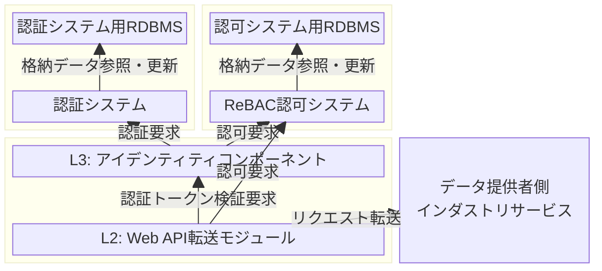
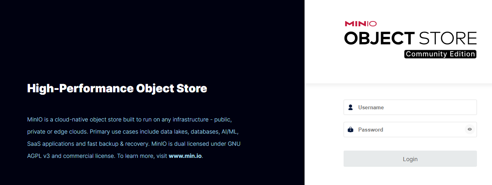
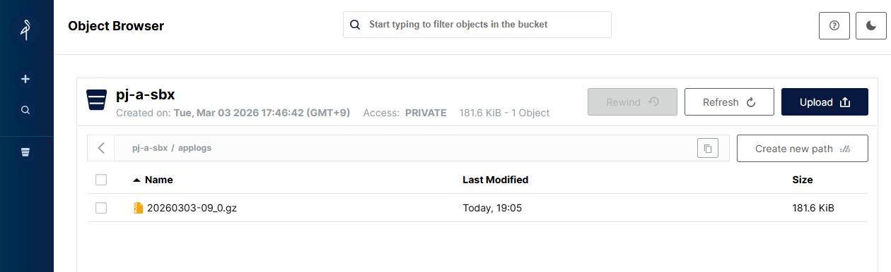

# ODS SDK for Onboarding デプロイ定義ファイル（Helm Chart用）

## 概要

本リポジトリでは、Open Dataspaces（以下ODS）が提供する SDK for Onbording の一つとして、Helm Chart 用のデプロイ定義ファイルを公開します。
これらの定義ファイルを使うことで、利用者は自身のKubernetes環境に ODS のコンポーネント群を容易に配備し使用することができます。

## 前提条件

本リポジトリで公開しているソフトウェアは、以下の環境で動作確認を行っています。

* マシンスペック: Core i7-1265U, 16GiB Mem, 500GB SSD
* OS: Windows 11 + WSL2 (Ubuntu 24.04)
* Docker Client: 28.1.1-rd, Server: 27.3.1, Compose: 2.37.1

## リポジトリ構成

本リポジトリのディレクトリ構成は以下の通りです。

| ファイル・ディレクトリ | 説明 |
| -------------------- | ---- |
| Chart.yaml           | 各コンポーネント用の定義を集約し、一括で起動・終了するためのデプロイ定義ファイル |
| charts/l2            | L2（トランザクションレイヤ）のコンポーネントである Web API転送モジュールのデプロイ定義ファイル格納先 |
| charts/l3            | L3（アイデンティティレイヤ）のコンポーネントであるアイデンティティコンポーネントのデプロイ定義ファイル格納先 |
| charts/logging       | ロギングサービスのデプロイ定義ファイル格納先 |
| charts/mockserver    | 動作確認用のモックサーバのデプロイ定義ファイル格納先 |
| charts/payment       | 精算・課金／決済サービスのデプロイ定義ファイル格納先 |
| setup                | 構築手順を簡易化・自動化するためのスクリプト群 |

## 構築手順

### システム構成図

本SDKで構築するコンポーネント・サービスは以下の通りです。四角形がコンポーネントもしくはサービス、矢印はそれらの間の依存関係を表します。



なお、本SDKではRDBMSとしてPostgreSQL、認証システムとしてKeycloak、ReBAC認可システムとしてOpenFGAを用います。
また以降では、アイデンティティコンポーネント・Web API転送モジュールを、それぞれ単にL3・L2と呼称する場合があります。

以下、特に断りがない限り、各コマンドは本リポジトリを `git clone` したルートディレクトリで実行するものとします。

### 起動・停止

起動

```
$ helm install ods .
```

停止

```
$ helm uninstall ods
```

### 各コンポーネントの初期設定

各コンポーネントの初期設定手順を以下に示します。

#### 事前準備 各コンポーネントのimage取得

各コンポーネントをHelm Chartで起動する場合は事前にKubernetes環境にimageを取り込む必要があります。
なお、本Helm Chartでは[Docker Compose版のデプロイ定義ファイル](https://github.com/open-dataspaces/SDK-docker-compose)内でビルドされるimageと同様のものを想定しています。  
imageをビルドする場合 Docker Compose を取得し、[各コンポーネントの初期設定](https://github.com/open-dataspaces/SDK-docker-compose?tab=readme-ov-file#%E5%90%84%E3%82%B3%E3%83%B3%E3%83%9D%E3%83%BC%E3%83%8D%E3%83%B3%E3%83%88%E3%81%AE%E5%88%9D%E6%9C%9F%E8%A8%AD%E5%AE%9A)の公式リポジトリからコピー後、以下のコマンドを実行してください。

```
$ docker build . -f ./l3/Dockerfile -t openfga-authzen:latest
$ docker build . -f ./l3/Dockerfile-local -t l3-app:latest
$ docker build . -f ./l2/Dockerfile -t ods/dp-http:latest
$ docker build . -f ./payment/Dockerfile -t payment-app:latest
```

上記の手順でビルドしたimageをKubernetes環境に取り込む例として、kindを使用する場合の例を示します。なお、クラスタ名はods、ネームスペースはdefaultとしています。

```
$ kind load docker-image ods/dp-http:latest openfga-authzen:latest l3-app:latest payment-app:latest --name ods
```

環境の準備が完了したら、リポジトリのトップレベルに配置されている Chart.yaml ファイルを使ってすべてのサービスを起動します。
```
$ helm install ods .
```

以下のように表示されたらデプロイ完了です。
```
NAME: ods
LAST DEPLOYED: Tue Mar 17 16:32:51 2026
NAMESPACE: default
STATUS: deployed
REVISION: 1
TEST SUITE: None
```

この状態から、コンポーネント別の初期設定を行います。

#### L3: アイデンティティコンポーネント

L3では、[サービス起動](https://github.com/open-dataspaces/L3-identity-component/tree/v1.0.0?tab=readme-ov-file#1-%E3%82%B5%E3%83%BC%E3%83%93%E3%82%B9%E8%B5%B7%E5%8B%95)および[参考実装チュートリアル](https://github.com/open-dataspaces/L3-identity-component/blob/v1.0.0/docs/tutorials/tutorials.md)に示す初期設定が必要です。
本SDKでは、後者の「[2. ユーザ認証システム動作確認](https://github.com/open-dataspaces/L3-identity-component/blob/v1.0.0/docs/tutorials/tutorials.md#2-%E3%83%A6%E3%83%BC%E3%82%B6%E8%AA%8D%E8%A8%BC%E3%82%B7%E3%82%B9%E3%83%86%E3%83%A0%E5%8B%95%E4%BD%9C%E7%A2%BA%E8%AA%8D)」までを一括で実施するスクリプトを提供しています。実行方法は以下の通りです。

```
$ cd setup
$ bash setup_l3.sh
$ cd -
$ helm upgrade ods .
```

上記の手順で Keycloak に作成される2つのクライアントID（クライアントシステム認証およびユーザ当人認証）は、[2. ユーザ認証システム動作確認](https://github.com/open-dataspaces/L3-identity-component/blob/v1.0.0/docs/tutorials/tutorials.md#2-%E3%83%A6%E3%83%BC%E3%82%B6%E8%AA%8D%E8%A8%BC%E3%82%B7%E3%82%B9%E3%83%86%E3%83%A0%E5%8B%95%E4%BD%9C%E7%A2%BA%E8%AA%8D) で作成されるものと同一です。
変更する場合は setup/setup_l3.sh を編集してください。

次に以下のコマンドを実行することで、OpenFGA のストア及び認可モデルを作成し、その内容を `charts/l2/values.yaml` に反映します。

```
$ cd setup
$ bash setup_l2.sh
$ cd -
```

上記の手順で OpenFGA に作成されるストア名は "ODS-USER-STORE" です。変更する場合は setup/openfga/51-create-user-store.json を編集してください。

#### L2: Web API転送モジュール

上記の手順を行うことで、L2 の起動に必要な設定は `charts/l2/values.yaml` に反映されているため、追加で必要な設定はありません。


## 運用構築

### 事前準備

#### ポートフォワード

本手順ではKubernetes上に立ち上げた各サービスに対してポートフォワードを行い動作を実施します。

```
$ kubectl port-forward svc/ods-l3-l3-app 8080:8080
$ kubectl port-forward svc/ods-l3-keycloak 8082:8082
$ kubectl port-forward svc/ods-l3-openfga 8083:8083

$ kubectl port-forward svc/ods-l2-gateway 8090:8090
```

#### アクセストークンの有効時間変更
アクセストークンの有効時間はデフォルトで60秒ですが、短い場合は必要に応じて延長します。
有効時間を300秒に延長する例を以下に示します。

```
$ ADMIN_ACCESS_TOKEN=$(
  curl -s -X POST "http://localhost:8082/realms/master/protocol/openid-connect/token" \
    -H "Content-Type: application/x-www-form-urlencoded" \
    -d "grant_type=password" \
    -d "client_id=admin-cli" \
    -d "username=admin" \
    -d "password=password" | jq -r .access_token
)

$ curl -X PUT "http://localhost:8082/admin/realms/master" \
    -H "Authorization: Bearer ${ADMIN_ACCESS_TOKEN}" \
    -H "Content-Type: application/json" \
    -d '{"accessTokenLifespan": 300}'
```

### 運用開始に向けた各種データ設定

[参考実装チュートリアル 2-1. 認証情報の作成（事業者情報/個人ユーザ/クライアントID）](https://github.com/open-dataspaces/L3-identity-component/blob/v1.0.0/docs/tutorials/tutorials.md#2-1-%E8%AA%8D%E8%A8%BC%E6%83%85%E5%A0%B1%E3%81%AE%E4%BD%9C%E6%88%90%E4%BA%8B%E6%A5%AD%E8%80%85%E6%83%85%E5%A0%B1%E5%80%8B%E4%BA%BA%E3%83%A6%E3%83%BC%E3%82%B6%E3%82%AF%E3%83%A9%E3%82%A4%E3%82%A2%E3%83%B3%E3%83%88id)に記載の手順に従い、事業者情報の登録から[2-1-5. 事業者クライアントシークレット取得](https://github.com/open-dataspaces/L3-identity-component/blob/v1.0.0/docs/tutorials/tutorials.md#2-1-5-%E4%BA%8B%E6%A5%AD%E8%80%85%E3%82%AF%E3%83%A9%E3%82%A4%E3%82%A2%E3%83%B3%E3%83%88%E3%82%B7%E3%83%BC%E3%82%AF%E3%83%AC%E3%83%83%E3%83%88%E5%8F%96%E5%BE%97)までを実行してください。宛先のホストには localhost:8080 を指定してください。また、本手順で必要な `$SYSTEM_CLIENT_SECRET` には、l3/docker-compose.yml の以下の設定値を、`API-Key`は`API-Key-Sample`を、`client_id`には`system-auth-sample`指定してください。

```
l3KeycloakIntrospectClientSecret
```

### コンポーネント間の環境設定

L2がL3と連携できるよう、charts/l2/values.yaml の以下の項目に認証システム (Keycloak) の URLを設定してください。  
なお、本SDKで用意している Helm Chart では、KeycloakのURLとして同一クラスタ上でL3を立ち上げている場合のサービスURLが既に設定されています。
何らかの理由でL3のURLを変更した場合は下記の値を変更してください。

```
keycloakUrl
```

### インダストリサービス連携方法

データ提供者側のインダストリサービスと連携するために必要な設定は以下の通りです。
なお本手順では、インダストリサービスの例として用意したモックサーバに対する通信を許可する例を示します。 

#### L3: アイデンティティコンポーネント

##### OpenFGAストアへのタプル登録

以下のコマンドを実行して、インダストリサービスに対する認可タプルを OpenFGA のストアに登録します。 
コマンド中の変数には以下の値を指定してください。

| 変数 | 値 |
|---|---|
| `$USER_STORE_ID` | charts/l2/values.yaml 内の `fgaStoreId` の設定値 |

```
$ curl -i -X POST \
  http://localhost:8083/stores/$USER_STORE_ID/write \
  -H "Content-Type: application/json" \
  -d '{
  "writes": {
    "tuple_keys": [
      { "user": "group:endpoint-test-get#member",    "relation": "can_access", "object": "endpoint:test.get" },
      { "user": "group:endpoint-test-post#member",   "relation": "can_access", "object": "endpoint:test.post" },
      { "user": "group:endpoint-test-put#member",    "relation": "can_access", "object": "endpoint:test.put" },
      { "user": "group:endpoint-test-delete#member", "relation": "can_access", "object": "endpoint:test.delete" }
    ],
    "on_duplicate": "ignore"
  }
}'
```

ここでは、インダストリサービスが公開する endpoint に対して、CRUD の各操作ごとに権限グループを作成しています。
たとえば tuple_keys 内の1行目は、「グループ endpoint-test-get のメンバーであるユーザは、対象のエンドポイント test.get に対してアクセス可能な関係 (can_access) である」ことを意味しています。
ここでオブジェクト中のエンドポイント「test.get」は、後述するL2の設定において定義されるルート（インダストリサービスへのリクエスト転送先）に対応しています。
同様に2～4行目も、「グループ endpoint-test-post/put/delete のメンバーであるユーザは、それぞれエンドポイント test.post/put/delete にアクセスできる」ことを表しています。

##### 事業者への認可付与

次に、インダストリサービスに対する事業者の認可設定をストアに登録するため、以下のコマンドを実行します。
コマンド中の変数には以下の値を指定してください。

| 変数 | 値 |
|---|---|
| `$USER_STORE_ID` | charts/l2/values.yaml 内の `fgaStoreId` の設定値 |
| `$USER_MODEL_ID` | charts/l2/values.yaml 内の `fgaModelId` の設定値 |
| `$OPERATOR_ID` | 事業者情報の登録（上述）で発行された `operator_id` |

```
$ curl -i -X POST "http://localhost:8083/stores/$USER_STORE_ID/write" \
      -H "Content-Type: application/json" \
      -d '{
        "authorization_model_id": "'$USER_MODEL_ID'",
        "writes": {
          "tuple_keys": [
            {
              "user": "user:'$OPERATOR_ID'",
              "relation": "member",
              "object": "group:endpoint-test-post"
            }
          ]
        }
      }'
```

ここでは、事業者をインダストリサービスに post を送る権限を持つグループに追加しています。
付与する権限を変更する際は、`object` プロパティの値を対応するグループに置き換えて実行してください。

#### L2: Web API転送モジュール

L2 では、`charts/l2/values.yaml` への情報反映（OpenFGA ストア名および認可モデル名）と変更の適用、およびルート設定が必要です。
このうち情報反映については、初期設定手順中にある setup/setup_l2.sh を実行していれば、charts/l2/values.yaml が自動で編集されるため実施は不要です。
もし setup/setup_l2.sh を実行せずに OpenFGA ストアと認可モデルを作成した場合は、charts/l2/values.yaml 中の以下のパラメータに、作成したストアと認可モデルのIDをそれぞれ指定してください。

```
fgaStoreId
fgaModelId
```

以下のコマンドでL2を再起動し、設定の変更を適用します。

```
$ helm upgrade ods .
```

次に、インダストリサービスにリクエストを転送するための、ルートの設定を行います。
ここではモックサーバに対する通信を POST のみ許可する例を示します。以下のコマンドを実行してください。

```
$ curl -X POST\
    -H "Content-Type: application/json"\
    -H "X-API-KEY: your-secret-management-api-key"\
    -d '{
    "id": "route01",
    "uri": "http://mockoon.default.svc.cluster.local:4011/test",
    "predicates": [{
        "name": "Path",
        "args": {
        "_genkey_0": "/test**"
         }
     },
      { 
        "name": "Method",
        "args": { 
        "_genkey_0": "POST"
         }
      }],
    "metadata": {
      "endpointId": "test.post"
     }    
    }'\
    http://localhost:8090/actuator/gateway/routes/route01
```

上記のコマンドを実行することで、データ利用者からの「http://(L2のFQDN)/test」に対するリクエストが、フィールド "uri" に指定されたインダストリサービスのURL (ここでは http://mockoon.default.svc.cluster.local:4011/test) に転送されるようになります。
ここでメタデータとして指定している "endpointId" の値 "test.post" は、OpenFGA に object として登録したエンドポイント "endpoint:test.post" に対応しています。
これにより、OpenFGA でグループ group:endpoint-test-post に所属しているユーザであれば、本URLにPOSTメソッドを送信できるようになります。

なお、ルートの登録時には、公開するパスの変更やヘッダの追加・削除などが可能です。下の例を参考に、必要な設定を上記の送信データに追加してください。

```
    "filters": [
    {
        "name": "RewritePath",
        "args": {
        "_genkey_0": "/外部に公開するアドレス/(?<segment>.*)",
        "_genkey_1": "/${segment}"
         }
    },
    {
        "name": "AddRequestHeader",
        "args": {
            "name": "インダストリサービスで利用する任意のヘッダ名",
            "value": "任意の値"
        }
    },
    {
        "name": "RemoveRequestHeader",
        "args": {
        "name": "インダストリサービスで不要なヘッダ名"
         }
    }],
```

#### データ利用者

データ利用者は、以下のHTTPヘッダをリクエストに設定する必要があります。
インダストリサービスへのアクセスの際に必要なヘッダ情報は以下です。

| ヘッダー名 | 内容 |
|---:|---|
| API-Key | 本サービスから払い出されたAPIキー |
| Authorization | L3(アイデンティティコンポーネントで発行したアクセストークン (JWT形式))  |
| X-TrackingId | 来歴管理⽤ログ出⼒項⽬ (UUID形式) |
| X-ODS-xxx | ロギング対象項目。xxxにはサービス提供者などから指定された文字列を指定（例：X-ODS-UserId） |

#### データ提供者

データ提供者は設定したルート設定に対応したインダストリサービスを立ち上げます。  
本手順では例としてモックサーバを使用します。なおすべてのサービスを一括で立ち上げている場合、本モックサーバは既に起動済みです。

### データ交換

本リポジトリのデプロイ定義ファイルで配備されるコンポーネント群、およびそれらと連携するインダストリサービスを用いて、利用者と提供者との間でデータ交換を行う手順を以下に示します。

1. アクセストークンの取得
   [L3 参考実装チュートリアル 2-2-1. アクセストークン取得（事業者クライアントID認証）](https://github.com/open-dataspaces/L3-identity-component/blob/v1.0.0/docs/tutorials/tutorials.md#2-2-1-%E3%82%A2%E3%82%AF%E3%82%BB%E3%82%B9%E3%83%88%E3%83%BC%E3%82%AF%E3%83%B3%E5%8F%96%E5%BE%97%E4%BA%8B%E6%A5%AD%E8%80%85%E3%82%AF%E3%83%A9%E3%82%A4%E3%82%A2%E3%83%B3%E3%83%88id%E8%AA%8D%E8%A8%BC)を実施しアクセストークンを取得します。なお、宛先のホストには localhost:8080 を、`API-Key`は`API-Key-Sample`を指定してください。

2. データアクセス  
  取得したアクセストークンを用いてデータアクセスを実施します。
  ルート登録で設定したインダストリサービスに対してPOSTを実行する場合は以下を実行してください。

    ```
    $ curl -X POST "http://localhost:8090/test" \
      -H 'api-key: 2dfd3409-ce01-4451-96fa-7e10c9681422y' \
      -H "Authorization: bearer $ACCESS_TOKEN" \
      -H 'X-ODS-UserId: 112233' \
      -H "Content-Type: application/json" \
      -H "Prefer: return=representation" \
      -d '{"userid":112233}' | jq .
    ```
    /testエンドポイントから、以下のようなレスポンスが返却されます。
    ```
    {
      "message": "Request successfully delivered!"
    }
    ```

### 精算・課金／決済

精算・課金／決済サービスでは、データ提供者が登録した利用料モデルに従い、利用者と提供者の間で行われたデータ交換の履歴に基づいて両者への支払／請求額を計算し提示する機能と、外部サービスと連携して実際の決済を行う機能を提供します。取引の実績は利用者・提供者の双方から登録するとともに、Web API転送モジュールから収集したログ情報とも突合することで、正当性を担保します。詳細は[精算・課金／決済サービスのドキュメント](https://github.com/open-dataspaces/DCS-Payment)を参照してください。

#### 準備

1. 精算・課金／決済データベースのマイグレーションを実行します。

```
# Pod 名を取得
$ kubectl get pods -l app=ods-payment-payment-app

# Pod に接続してマイグレーション実行
$ cd ./setup
$ kubectl exec -it <pod-name> -- alembic -c migrations/alembic.ini upgrade head
...

INFO  [alembic.runtime.migration] Context impl PostgresqlImpl.
INFO  [alembic.runtime.migration] Will assume transactional DDL.
INFO  [alembic.runtime.migration] Running upgrade  -> 001_initial, Initial tables - 全テーブル統合版
$ cd -
```

2. charts/payment/values.yaml 中の以下のパラメータに, chart/l3/values.yaml 中の `l3KeycloakIntrospectClientSecret` と同じ値を設定し、精算・課金／決済サービスを再起動して反映します。
   なお、今回は説明を簡潔にするため、精算・課金／決済サービスの認可機能を無効化しています。実運用システムでは、[精算・課金／決済サービスのドキュメント](https://github.com/open-dataspaces/DCS-Payment)を参照の上、認可機能を適切に設定してください。

```
paymentL3ClientSecret
```

```
$ helm upgrade ods .
```

3. あらかじめ、動作確認用にダミーの決済サービスと、その決済サービスに紐付けられたデータ提供者・データ利用者をDBに登録します。
   ここでは簡単のため、データ提供者とデータ利用者に同一のIDを使用します。
   また、登録したサービスのIDを変数に記憶しておきます。

```
# Pod 名を取得
$ kubectl get pods -l app=ods-payment-payment-db

$ kubectl exec -it <ods-payment-payment-db name> -c payment-db -- psql fastapi_db -U postgres -c "INSERT INTO payment_services VALUES ('$PAYMENT_SERVICE_ID', 'test_service', 'http://example.com/')"

$ kubectl exec -it <ods-payment-payment-db name> -c payment-db -- psql fastapi_db -U postgres -c 'SELECT * FROM payment_services'
          payment_service_id          | payment_service_name | payment_service_url |          created_at          |          updated_at
--------------------------------------+----------------------+---------------------+------------------------------+------------------------------
 4228ff2a-28f5-11f1-b3c8-00155d45e553 | test_service         | http://example.com/ | 2026-03-26 09:30:14.98468+00 | 2026-03-26 09:30:14.98468+00
(1 row)

$ kubectl exec -it <ods-payment-payment-db name> -c payment-db -- psql fastapi_db -U postgres -c "INSERT INTO payment_service_user_registrations VALUES ('$OPERATOR_ID', '$PAYMENT_SERVICE_ID', '$OPERATOR_ID', '$OPERATOR_ID')"
INSERT 0 1

$ kubectl exec -it <ods-payment-payment-db name> -c payment-db -- psql fastapi_db -U postgres -c '\x' -c 'SELECT * FROM payment_service_user_registrations'
Expanded display is on.
-[ RECORD 1 ]-----------+-------------------------------------
payment_service_user_id | 3d5eebe5-367a-46d9-8c76-5d7c4073fbbb
payment_service_id      | 4228ff2a-28f5-11f1-b3c8-00155d45e553
consumer_id             | 3d5eebe5-367a-46d9-8c76-5d7c4073fbbb
provider_id             | 3d5eebe5-367a-46d9-8c76-5d7c4073fbbb
company_name            |
department              |
customer_name           |
zip_code                |
address                 |
tel_no                  |
external_buyer_id       |
external_data           |
created_at              | 2026-03-26 09:30:27.700757+00
updated_at              | 2026-03-26 09:30:27.700757+00
```

4. [L3 参考実装チュートリアル 2-2-1. アクセストークン取得（事業者クライアントID認証）](https://github.com/open-dataspaces/L3-identity-component/blob/v1.0.0/docs/tutorials/tutorials.md#2-2-1-%E3%82%A2%E3%82%AF%E3%82%BB%E3%82%B9%E3%83%88%E3%83%BC%E3%82%AF%E3%83%B3%E5%8F%96%E5%BE%97%E4%BA%8B%E6%A5%AD%E8%80%85%E3%82%AF%E3%83%A9%E3%82%A4%E3%82%A2%E3%83%B3%E3%83%88id%E8%AA%8D%E8%A8%BC)を実行し、アクセストークンを取得します。宛先のホストには localhost:8080 を、`API-Key`は`API-Key-Sample`を指定してください。

#### 利用料モデル登録（提供者）

今回は例として、利用者と提供者に同一のIDを使用します。
以下のリクエストを送信し、精算・課金／決済サービスに利用料モデルを登録します。  
なお、本手順でもポートフォワードを行い動作を実施しています。
```
$ kubectl port-forward svc/ods-payment-payment-app 8001:8001
```

```
$ curl -X POST \
  -H "Content-Type: application/json" \
  -H "Authorization: Bearer $ACCESS_TOKEN" \
  -H "X-TrackingId: $(uuidgen -t)" \
  -H "x-payment-api-key: payment-api-key" \
  -d '{
    "fee_model_name": "通常モデル",
    "price": 1000,
    "tax_classification": "taxable",
    "tax_rate": 0.10,
    "provider_id": "'"$OPERATOR_ID"'",
    "consumer_id": "'"$OPERATOR_ID"'",
    "data_id": "'"I0101"'",
    "payment_service_id": "550e8400-e29b-41d4-a716-446655440000",
    "valid_from": "'$(date -Iseconds -u)'",
    "is_active": "true",
    "version": 1
  }' \
  localhost:8001/api/v1/fee-model
```

成功すると、以下のようなレスポンスが返却されます。

```
{
  "created_at":"2026-03-26T09:48:51.063694Z",
  "updated_at":"2026-03-26T09:48:51.063694Z",
  "valid_from":"2026-03-26T09:48:50Z",
  "is_active":true,
  "version":1,
  "storage_type":"provider_env",
  "storage_key":"",
  "valid_to":null,
  "provider_id":"3d5eebe5-367a-46d9-8c76-5d7c4073fbbb","consumer_id":"3d5eebe5-367a-46d9-8c76-5d7c4073fbbb",
  "data_id":"I0101",
  "payment_service_id":"4228ff2a-28f5-11f1-b3c8-00155d45e553",
  "fee_model_name":"通常モデル",
  "price":"1000.00",
  "tax_classification":"taxable",
  "tax_rate":"0.1000",
  "fee_model_id":"1f6fb614-f513-4f44-ba12-09af657de32b"}
```

#### 利用料モデル一覧取得（提供者）

登録した利用料モデルは、以下のリクエストで確認できます。

```
$ curl -s \
  -H "Content-Type: application/json" \
  -H "Authorization: Bearer $ACCESS_TOKEN" \
  -H "X-TrackingId: $(uuidgen -t)" \
  -H "x-payment-api-key: payment-api-key" \
  localhost:8001/api/v1/fee-model
```

成功すると、以下のようなレスポンスが返却されます。

```
{
  "models":[
    {"created_at":"2026-03-26T09:48:51.063694Z",
    "updated_at":"2026-03-26T09:48:51.063694Z",
    "valid_from":"2026-03-26T09:48:50Z",
    "is_active":true,"version":1,
    "storage_type":"provider_env",
    "storage_key":"","valid_to":null,
    "provider_id":"3d5eebe5-367a-46d9-8c76-5d7c4073fbbb",
    "consumer_id":"3d5eebe5-367a-46d9-8c76-5d7c4073fbbb",
    "data_id":"I0101",
    "payment_service_id":"4228ff2a-28f5-11f1-b3c8-00155d45e553",
    "fee_model_name":"通常モデル",
    "price":"1000.00",
    "tax_classification":"taxable",
    "tax_rate":"0.1000",
    "fee_model_id":"1f6fb614-f513-4f44-ba12-09af657de32b"
    }
  ]
}
```

#### データ交換状態登録（利用者・提供者）

データ交換が終了したタイミングで、利用者・提供者の双方から取引の実績を精算・課金／決済サービスに登録します。
対象となるデータ交換は、交換時に使用した `X-TrackingId` ヘッダ値で識別します。この例ではダミーの値を使用します。

```
$ export TRACKING_ID=$(uuidgen -t)
$ curl -X POST \
  -H "Content-Type: application/json" \
  -H "Authorization: Bearer $ACCESS_TOKEN" \
  -H "X-TrackingId: $(uuidgen -t)" \
  -H "x-payment-api-key: payment-api-key" \
  -d '{
    "tracking_id": "'"$TRACKING_ID"'",
    "provider_id": "'"$OPERATOR_ID"'",
    "consumer_id": "'"$OPERATOR_ID"'",
    "data_id_list": ["I0101"],
    "completed_at": "'$(date -Iseconds -u)'",
    "status": "completed"
  }' \
  localhost:8001/api/v1/data-exchange/status
```

登録に成功すると、以下のレスポンスが返却されます。

```
{"status":"success","detail":"Data exchange status registered"}
```

#### 支払予定額取得（利用者）

利用者は以下のリクエストで、当日分の支払予定額を確認できます。

```
$ curl -X POST \
  -H "Content-Type: application/json" \
  -H "Authorization: Bearer $ACCESS_TOKEN" \
  -H "X-TrackingId: $(uuidgen -t)" \
  -H "x-payment-api-key: payment-api-key" \
  -d '{
    "provider_id": "'"$OPERATOR_ID"'",
    "start_date": "'$(date -I)'",
    "end_date": "'$(date -I -d'+1 day')'"
  }' \
  localhost:8001/api/v1/payment
```

成功すると、以下のようなレスポンスが返却されます。

```
{
  "payment_details": [
    {
      "tracking_id": "93c19b42-1155-11f1-9c92-00155d72de61",
      "fee_model_id": "1f6fb614-f513-4f44-ba12-09af657de32b",
      "payment_service_id": "4228ff2a-28f5-11f1-b3c8-00155d45e553",
      "provider_id":"3d5eebe5-367a-46d9-8c76-5d7c4073fbbb",
      "consumer_id":"3d5eebe5-367a-46d9-8c76-5d7c4073fbbb",
      "data_id_list": [
        "I0101"
      ],
      "completed_at": "2026-03-26T09:53:50Z",
      "amount": 1100.0,
      "tax_rate": 0.1
    }
  ],
  "total_amount": 1100.0
}
```

#### 請求予定額取得（提供者）

提供者は以下のリクエストで、当日分の請求予定額を確認できます。

```
$ curl -X POST \
  -H "Content-Type: application/json" \
  -H "Authorization: Bearer $ACCESS_TOKEN" \
  -H "X-TrackingId: $(uuidgen -t)" \
  -H "x-payment-api-key: payment-api-key" \
  -d '{
    "consumer_id": "'"$OPERATOR_ID"'",
    "start_date": "'$(date -I)'",
    "end_date": "'$(date -I -d'+1 day')'"
  }' \
  localhost:8001/api/v1/billing
```

成功すると、以下のようなレスポンスが返却されます。

```
{
  "billing_details": [
    {
      "tracking_id": "93c19b42-1155-11f1-9c92-00155d72de61",
      "fee_model_id": "1f6fb614-f513-4f44-ba12-09af657de32b",
      "payment_service_id": "4228ff2a-28f5-11f1-b3c8-00155d45e553",
      "provider_id":"3d5eebe5-367a-46d9-8c76-5d7c4073fbbb",
      "consumer_id":"3d5eebe5-367a-46d9-8c76-5d7c4073fbbb",
      "data_id_list": [
        "I0101"
      ],
      "completed_at": "2026-03-26T09:53:50Z",
      "amount": 1100.0,
      "tax_rate": 0.1
    }
  ],
  "total_amount": 1100.0
}
```

### 監視

各コンポーネント／サービスが出力するログの種類は以下の通りです。

#### L2: Web API転送モジュール

L2が出力したログは、ロギングサービスによってloggingサービス内で作成したPVC内に格納されます。
PVC内のデフォルトの出力先は以下です。
変更する場合は、charts/logging/values.yaml を編集してください。

| 出力先パス | 説明 |
| ------------------ | ---- |
| data/pj-a-sbx/applogs | ログファイルは1時間ごとにローテーションされる |

こちらのログについては直接ディレクトリを参照する他に、MinIOのコンソールにアクセスすることでブラウザからも確認できます。
http://localhost:9001/login からアクセスしユーザ名とパスワードを入力します。

なお、本手順実行前にポートフォワードを実施してください。

```
$ kubectl port-forward svc/ods-logging-minio 9001:9001
```



- ユーザ名: minio-sample
- パスワード: XXXXXXXXXXXXXXXXXXXXXXXXXXXXXXXXX

これらのユーザ名、パスワードはcharts/logging/values.yaml を編集することで変更可能です。　
なお変更した場合、charts/logging/files/fluentd.conf 内のMinIO設定を編集してください。

ログインに成功すると保存されているログを確認することができます。階層構造はディレクトリ構造にならい「pj-a-sbx/applogs」になっています。



applog配下にログファイルが保存されているため、ダウンロード後解凍することで内容を確認できます。


#### L3: アイデンティティコンポーネント

L3は標準出力および標準エラー出力にログを出力します。
Kubernetes 上で実行している場合、以下のコマンドでログを確認できます。

```
$ kubectl logs deployment/ods-l3-l3-app
```

#### 精算・課金／決済サービス

精算・課金／決済サービスは標準出力および標準エラー出力にログを出力します。
Kubernetes 上で実行している場合、以下のコマンドでログを確認できます。

```
$ kubectl logs deployment/ods-payment-payment-app
```

## ライセンス

- 本リポジトリはMITライセンスで提供されています。
- ソースコードおよび関連ドキュメントの著作権は株式会社NTTデータグループ、株式会社NTTデータに帰属します。

## 免責事項

- 本リポジトリの内容は予告なく変更・削除する可能性があります。
- 本リポジトリの利用により生じた損失及び損害等について、いかなる責任も負わないものとします。
