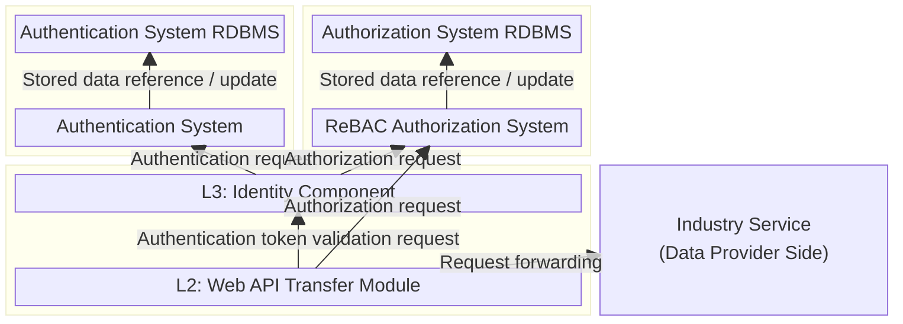

# ODS SDK for Onboarding Deployment Definition Files (Helm Chart)

## Overview

This repository provides deployment definition files for Helm Charts as one of the SDK for Onboarding provided by Open Data Spaces (hereinafter referred to as "ODS").
By using these definition files, users can easily deploy and use the ODS components in their own Kubernetes environments.

## Prerequisites

The software published in this repository has been verified to operate in the following environment:

- Machine specifications: Core i7-1265U, 16 GiB memory, 500 GB SSD
- OS: Windows 11 + WSL2 (Ubuntu 24.04)
- Docker:
  - Client: 28.1.1-rd  
  - Server: 27.3.1  
  - Compose: 2.37.1

## Repository Structure

The directory structure of this repository is as follows:

| File / Directory | Description |
| ---------------- | ----------- |
| Chart.yaml | Top-level deployment definition that aggregates component definitions and allows them to be started and stopped together |
| charts/l2 | Directory containing deployment definitions for the L2 (Transaction Layer) component: Web API Transfer Module |
| charts/l3 | Directory containing deployment definitions for the L3 (Identity Layer) component: Identity Component |
| charts/logging | Directory containing deployment definitions for the logging service |
| charts/mockserver | Directory containing deployment definitions for the mock server used for verification |
| charts/payment | Directory containing deployment definitions for the Clearing and Payment Service |
| setup | Collection of scripts that simplify and automate the setup procedures |

## Setup Procedure

### System Architecture Diagram

The components and services deployed by this SDK are shown below.  
Rectangles represent components or services, and arrows represent dependency relationships between them.



In this SDK, PostgreSQL is used as the RDBMS, Keycloak is used as the authentication system, and OpenFGA is used as the ReBAC authorization system.
Hereafter, the Identity Component and Web API Transfer Module may be referred to simply as L3 and L2, respectively.

Unless otherwise specified, all commands are assumed to be executed from the root directory created by `git clone` of this repository.

### Startup and Shutdown

#### Startup

```bash
$ helm install ods .
```

#### Shutdown

```
$ helm uninstall ods
```

### Initial Configuration of Each Component

The initial setup procedures for each component are described below.

#### Preliminary Steps — Pulling Container Images for Each Component

When deploying the components using Helm Charts, the required container images must be loaded into the Kubernetes environment in advance.
This Helm Chart assumes the same images that are built using the Docker Compose–based deployment definitions available in the following repository: https://github.com/open-dataspaces/SDK-docker-compose  

To build the images, obtain Docker Compose, copy the necessary files from the official repository referenced in [Initial Setup of Each Component](https://github.com/open-dataspaces/SDK-docker-compose/blob/main/README_en.md#initial-setup-of-each-component), and then execute the following commands:

```
$ docker build . -f ./l3/Dockerfile -t openfga-authzen:latest
$ docker build . -f ./l3/Dockerfile-local -t l3-app:latest
$ docker build . -f ./l2/Dockerfile -t ods/dp-http:latest
$ docker build . -f ./payment/Dockerfile -t payment-app:latest
```

As an example of loading the images built using the above steps into a Kubernetes environment, the following shows an example using **kind**.  
In this example, the cluster name is set to `ods`, and the namespace is `default`.

```
$ kind load docker-image ods/dp-http:latest openfga-authzen:latest l3-app:latest payment-app:latest --name ods
```

Once the environment preparation is complete, start all services using the `Chart.yaml` file located at the top level of the repository.

```
$ helm install ods .
```

If the following output is displayed, the deployment has been completed successfully.

```
NAME: ods
LAST DEPLOYED: Tue Mar 17 16:32:51 2026
NAMESPACE: default
STATUS: deployed
REVISION: 1
TEST SUITE: None
```

From this state, proceed with the initial configuration for each component.

#### L3: Identity Component

For L3, the initial setup described in [Service Startup](https://github.com/open-dataspaces/L3-identity-component/blob/main/README_en.md#1-service-startup) and the [Reference Implementation Tutorial](https://github.com/open-dataspaces/L3-identity-component/blob/main/docs/tutorials/tutorials_en.md) is required.

This SDK provides a script that executes all steps in the latter up to "[2. User Authentication System Verification](https://github.com/open-dataspaces/L3-identity-component/blob/main/docs/tutorials/tutorials_en.md#2-user-authentication-system-verification)" in a single execution. The execution procedure is as follows.

```
$ cd setup
$ bash setup_l3.sh
$ cd -
$ helm upgrade ods .
```

The two client IDs created in Keycloak by the above procedure (for client system authentication and end-user authentication) are identical to those created in ["2. User Authentication System Verification" of the Reference Implementation Tutorial](https://github.com/open-dataspaces/L3-identity-component/blob/main/docs/tutorials/tutorials_en.md#2-user-authentication-system-verification)

If you need to change these settings, edit `setup/setup_l3.sh`.

Next, execute the following commands to create the OpenFGA store and authorization model, and apply the generated values to `charts/l2/values.yaml`.

```
$ cd setup
$ bash setup_l2.sh
$ cd -
```

The store name created in OpenFGA by the above procedure is "ODS-USER-STORE".  
If you need to change this value, edit `setup/openfga/51-create-user-store.json`.

#### L2: Web API Transfer Module

By completing the above steps, all settings required to start L2 have already been reflected in `charts/l2/values.yaml`.  
Therefore, no additional configuration is required.


## Operations Setup

### Preliminary Steps

#### Port Forwarding

In this procedure, port forwarding is configured for each service running on Kubernetes to perform operation and verification.

```
$ kubectl port-forward svc/ods-l3-l3-app 8080:8080
$ kubectl port-forward svc/ods-l3-keycloak 8082:8082
$ kubectl port-forward svc/ods-l3-openfga 8083:8083

$ kubectl port-forward svc/ods-l2-gateway 8090:8090
```

#### Changing the Access Token Lifetime

The access token lifetime is set to 60 seconds by default.  
If this duration is too short, it can be extended as needed.
The following example shows how to extend the access token lifetime to 300 seconds.

```
$ ADMIN_ACCESS_TOKEN=$(
  curl -s -X POST "http://localhost:8082/realms/master/protocol/openid-connect/token" \
    -H "Content-Type: application/x-www-form-urlencoded" \
    -d "grant_type=password" \
    -d "client_id=admin-cli" \
    -d "username=admin" \
    -d "password=password" | jq -r .access_token
)

$ curl -X PUT "http://localhost:8082/admin/realms/master" \
    -H "Authorization: Bearer ${ADMIN_ACCESS_TOKEN}" \
    -H "Content-Type: application/json" \
    -d '{"accessTokenLifespan": 300}'
```

### Data Configuration for Starting Operations

Follow the steps described in [L3 Reference Implementation Tutorial 2‑1. Creating Authentication Information (Operator Information, Individual Users, Client IDs)](https://github.com/open-dataspaces/L3-identity-component/blob/main/docs/tutorials/tutorials_en.md#2-1-creation-of-authentication-information-operator-information--individual-users--client-ids), and execute the procedures from registering operator information through [2‑1‑5. Obtaining the Operator Client Secret](https://github.com/open-dataspaces/L3-identity-component/blob/main/docs/tutorials/tutorials_en.md#2-1-5-retrieving-the-operator-client-secret).

For this procedure, specify `localhost:8080` as the destination host, set `$SYSTEM_CLIENT_SECRET` to the value defined in `l3/docker-compose.yml` shown below, set `API-Key` to `API-Key-Sample`, and specify `system-auth-sample` as the `client_id`.

```
l3KeycloakIntrospectClientSecret
```

### Environment Configuration Between Components

To enable L2 to integrate with L3, configure the URL of the authentication system (Keycloak) in the following parameter in `charts/l2/values.yaml`.
In the Helm Chart provided by this SDK, the service URL to be used when L3 is running in the same cluster is already configured as the Keycloak URL.
If the URL of L3 is changed for any reason, update the value below accordingly.

```
keycloakUrl
```

### Industry Service Integration

The following describes the configuration required to integrate with industry services on the data provider side.
In this procedure, an example is shown that allows communication with a mock server prepared as a sample industry service.
 
#### L3: Identity Component

##### Registering Tuples in the OpenFGA Store

Execute the following command to register authorization tuples for the industry service in the OpenFGA store.
Specify the following values for the variables used in the command.

| Variable | Value |
| --- | --- |
| `$USER_STORE_ID` | Value of `fgaStoreId` configured in `charts/l2/values.yaml` |

```
$ curl -i -X POST \
  http://localhost:8083/stores/$USER_STORE_ID/write \
  -H "Content-Type: application/json" \
  -d '{
  "writes": {
    "tuple_keys": [
      { "user": "group:endpoint-test-get#member",    "relation": "can_access", "object": "endpoint:test.get" },
      { "user": "group:endpoint-test-post#member",   "relation": "can_access", "object": "endpoint:test.post" },
      { "user": "group:endpoint-test-put#member",    "relation": "can_access", "object": "endpoint:test.put" },
      { "user": "group:endpoint-test-delete#member", "relation": "can_access", "object": "endpoint:test.delete" }
    ],
    "on_duplicate": "ignore"
  }
}'
```

In this example, authorization groups are created for each CRUD operation on the endpoints exposed by the industry service.
For example, the first entry in `tuple_keys` means that users who are members of the group `endpoint-test-get` have a relationship (`can_access`) that allows them to access the target endpoint `test.get`.
Here, the endpoint `test.get` specified in the object corresponds to the route defined later in the L2 configuration, which represents the request forwarding destination to the industry service.
Similarly, the second through fourth entries indicate that users who are members of the groups `endpoint-test-post`, `endpoint-test-put`, and `endpoint-test-delete` can access the respective endpoints `test.post`, `test.put`, and `test.delete`.

##### Granting Authorization to an Operator

Next, execute the following command to register the operator’s authorization settings for the industry service in the OpenFGA store.
Specify the following values for the variables used in the command.

| Variable | Value |
| --- | --- |
| `$USER_STORE_ID` | Value of `fgaStoreId` configured in `charts/l2/values.yaml` |
| `$USER_MODEL_ID` | Value of `fgaModelId` configured in `charts/l2/values.yaml` |
| `$OPERATOR_ID` | `operator_id` issued when registering the operator information (described above) |

```
$ curl -i -X POST "http://localhost:8083/stores/$USER_STORE_ID/write" \
      -H "Content-Type: application/json" \
      -d '{
        "authorization_model_id": "'$USER_MODEL_ID'",
        "writes": {
          "tuple_keys": [
            {
              "user": "user:'$OPERATOR_ID'",
              "relation": "member",
              "object": "group:endpoint-test-post"
            }
          ]
        }
      }'
```

In this step, the operator is added to a group that has permission to send **POST** requests to the industry service.
To change the permissions to be granted, replace the value of the `object` property with the corresponding group and execute the command again.

#### L2: Web API Transfer Module

For L2, it is necessary to reflect information in `charts/l2/values.yaml` (the OpenFGA store ID and authorization model ID), apply the changes, and configure routing.

Regarding the configuration update, if `setup/setup_l2.sh` has been executed as part of the initial setup procedure, `charts/l2/values.yaml` is automatically updated and no additional action is required.

If the OpenFGA store and authorization model were created without executing `setup/setup_l2.sh`, specify the IDs of the created store and authorization model in the following parameters in `charts/l2/values.yaml`.

```
fgaStoreId
fgaModelId
```

Restart L2 using the following command to apply the configuration changes.

```
$ helm upgrade ods .
```

Next, configure routing to forward requests to the industry service.
In this example, a route configuration is shown that allows POST requests only to a mock server.Execute the following command.

```
$ curl -X POST\
    -H "Content-Type: application/json"\
    -H "X-API-KEY: your-secret-management-api-key"\
    -d '{
    "id": "route01",
    "uri": "http://mockoon.default.svc.cluster.local:4011/test",
    "predicates": [{
        "name": "Path",
        "args": {
        "_genkey_0": "/test**"
         }
     },
      { 
        "name": "Method",
        "args": { 
        "_genkey_0": "POST"
         }
      }],
    "metadata": {
      "endpointId": "test.post"
     }    
    }'\
    http://localhost:8090/actuator/gateway/routes/route01
```

By executing the above command, requests sent by data consumers to
`http://(L2 FQDN)/test` are forwarded to the industry service URL specified in the `"uri"` field
(in this example, `http://mockoon.default.svc.cluster.local:4011/test`).

The value `"test.post"` specified as `"endpointId"` in the metadata corresponds to the endpoint
`"endpoint:test.post"` that was registered as an object in OpenFGA.

As a result, users who belong to the OpenFGA group `group:endpoint-test-post`
are allowed to send POST requests to this URL.


When registering a route, it is also possible to modify the exposed path,
add or remove headers, and perform other customizations.

Refer to the example below and add any required settings to the request payload shown above.


```
    "filters": [
    {
        "name": "RewritePath",
        "args": {
        "_genkey_0": "/public/path/(?<segment>.*)",
        "_genkey_1": "/${segment}"
         }
    },
    {
        "name": "AddRequestHeader",
        "args": {
            "name": "Custom header name used by the industry service",
            "value": "Custom value"
        }
    },
    {
        "name": "RemoveRequestHeader",
        "args": {
        "name": "Header name not required by the industry service"
         }
    }],
```

#### Data Consumer

Data consumers must include the following HTTP headers in their requests.
The required headers for accessing the industry service are as follows.

| Header Name | Description |
| ---: | --- |
| API-Key | API key issued by this service |
| Authorization | Access token (JWT format) issued by L3 (Identity Component) |
| X-TrackingId | Log output field for traceability management (UUID format) |
| X-ODS-xxx | Fields subject to logging. Specify `xxx` with a string designated by the service provider (e.g., `X-ODS-UserId`) |

#### Data Provider

Data providers start the industry service that corresponds to the configured routing settings.
In this procedure, a mock server is used as an example.If all services are started together, this mock server is already running.

### Data Exchange

The following describes the procedure for performing data exchange between consumers and providers using the components deployed by the deployment definition files in this repository, as well as the industry services integrated with them.

1. Obtain an Access Token  
   Execute [L3 Reference Implementation Tutorial 2‑2‑1. Access Token Acquisition (Client Authentication)](https://github.com/open-dataspaces/L3-identity-component/blob/main/docs/tutorials/tutorials_en.md#2-2-1-obtaining-an-access-token-operator-client-id-authentication) to obtain an access token.
   Specify `localhost:8080` as the destination host and set `API-Key` to `API-Key-Sample`.

2. Data Access  
   Perform data access using the obtained access token.

   To send a POST request to the industry service configured in the route registration, execute the following command.

    ```
    $ curl -X POST "http://localhost:8090/test" \
      -H 'api-key: 2dfd3409-ce01-4451-96fa-7e10c9681422y' \
      -H "Authorization: bearer $ACCESS_TOKEN" \
      -H 'X-ODS-UserId: 112233' \
      -H "Content-Type: application/json" \
      -H "Prefer: return=representation" \
      -d '{"userid":112233}' | jq .
    ```
    A response similar to the following is returned from the `/test` endpoint.
    ```
    {
      "message": "Request successfully delivered!"
    }
    ```

### Clearing and Payment

The Clearing and Payment Service provides functions to calculate and present payment and billing amounts for both consumers and providers based on the usage fee models registered by data providers and the history of data exchanges conducted between them.

In addition, the service integrates with external services to perform actual payment processing.
Transaction records are registered by both consumers and providers, and are cross-checked with log information collected from the Web API Transfer Module to ensure validity.

For more details, refer to the documentation of the
[Clearing and Payment Service](https://github.com/open-dataspaces/DCS-Payment).


#### Preparation

1. Execute database migrations for the Clearing and Payment Service.

```
# Retrieve the Pod name
$ kubectl get pods -l app=ods-payment-payment-app

# Connect to the Pod and execute migrations
$ cd ./setup
$ kubectl exec -it <pod-name> -- alembic -c migrations/alembic.ini upgrade head
...

INFO  [alembic.runtime.migration] Context impl PostgresqlImpl.
INFO  [alembic.runtime.migration] Will assume transactional DDL.
INFO  [alembic.runtime.migration] Running upgrade  -> 001_initial, Initial tables - unified version
$ cd -
```

2. Set the same value as `l3KeycloakIntrospectClientSecret` defined in `chart/l3/values.yaml`
   for the following parameter in `charts/payment/values.yaml`, then restart the
   Clearing and Payment Service to apply the changes.

   For simplicity, the authorization feature of the settlement and payment service is disabled in this example.  
   In a production system, configure the authorization feature appropriately by referring to the [Clearing and Payment Service documentation](https://github.com/open-dataspaces/DCS-Payment).


```
paymentL3ClientSecret
```

```
$ helm upgrade ods .
```

3. Register a dummy payment service for verification purposes in advance, along with the associated data provider and data consumer, in the database.

   For simplicity, the same ID is used for both the data provider and the data consumer in this example.
   Also, store the ID of the registered service in a variable for later use.
```

# Retrieve the Pod name
$ kubectl get pods -l app=ods-payment-payment-db

$ kubectl exec -it <ods-payment-payment-db name> -c payment-db -- psql fastapi_db -U postgres -c "INSERT INTO payment_services VALUES ('$PAYMENT_SERVICE_ID', 'test_service', 'http://example.com/')"

$ kubectl exec -it <ods-payment-payment-db name> -c payment-db -- psql fastapi_db -U postgres -c 'SELECT * FROM payment_services'
          payment_service_id          | payment_service_name | payment_service_url |          created_at          |          updated_at
--------------------------------------+----------------------+---------------------+------------------------------+------------------------------
 4228ff2a-28f5-11f1-b3c8-00155d45e553 | test_service         | http://example.com/ | 2026-03-26 09:30:14.98468+00 | 2026-03-26 09:30:14.98468+00
(1 row)

$ kubectl exec -it <ods-payment-payment-db name> -c payment-db -- psql fastapi_db -U postgres -c "INSERT INTO payment_service_user_registrations VALUES ('$OPERATOR_ID', '$PAYMENT_SERVICE_ID', '$OPERATOR_ID', '$OPERATOR_ID')"
INSERT 0 1

$ kubectl exec -it <ods-payment-payment-db name> -c payment-db -- psql fastapi_db -U postgres -c '\x' -c 'SELECT * FROM payment_service_user_registrations'
Expanded display is on.
-[ RECORD 1 ]-----------+-------------------------------------
payment_service_user_id | 3d5eebe5-367a-46d9-8c76-5d7c4073fbbb
payment_service_id      | 4228ff2a-28f5-11f1-b3c8-00155d45e553
consumer_id             | 3d5eebe5-367a-46d9-8c76-5d7c4073fbbb
provider_id             | 3d5eebe5-367a-46d9-8c76-5d7c4073fbbb
company_name            |
department              |
customer_name           |
zip_code                |
address                 |
tel_no                  |
external_buyer_id       |
external_data           |
created_at              | 2026-03-26 09:30:27.700757+00
updated_at              | 2026-03-26 09:30:27.700757+00
```

4. Obtain an access token by executing [L3 Reference Implementation Tutorial 2‑2‑1. Access Token Acquisition (Client Authentication)](https://github.com/open-dataspaces/L3-identity-component/blob/main/docs/tutorials/tutorials_en.md#2-2-1-obtain-access-token-operator-client-id-authentication).
   Specify `localhost:8080` as the destination host and set `API-Key` to `API-Key-Sample`.

#### Registering a Usage Fee Model (Provider)

In this example, the same ID is used for both the data consumer and the data provider.

Send the following request to register a usage fee model with the Clearing and Payment Service.

Note that port forwarding is also performed in this procedure.

```
$ kubectl port-forward svc/ods-payment-payment-app 8001:8001
```

```
$ curl -X POST \
  -H "Content-Type: application/json" \
  -H "Authorization: Bearer $ACCESS_TOKEN" \
  -H "X-TrackingId: $(uuidgen -t)" \
  -H "x-payment-api-key: payment-api-key" \
  -d '{
    "fee_model_name": "standard-model",
    "price": 1000,
    "tax_classification": "taxable",
    "tax_rate": 0.10,
    "provider_id": "'"$OPERATOR_ID"'",
    "consumer_id": "'"$OPERATOR_ID"'",
    "data_id": "'"I0101"'",
    "payment_service_id": "550e8400-e29b-41d4-a716-446655440000",
    "valid_from": "'$(date -Iseconds -u)'",
    "is_active": "true",
    "version": 1
  }' \
  localhost:8001/api/v1/fee-model
```

If the operation is successful, a response similar to the following is returned.

```
{
  "created_at":"2026-03-26T09:48:51.063694Z",
  "updated_at":"2026-03-26T09:48:51.063694Z",
  "valid_from":"2026-03-26T09:48:50Z",
  "is_active":true,
  "version":1,
  "storage_type":"provider_env",
  "storage_key":"",
  "valid_to":null,
  "provider_id":"3d5eebe5-367a-46d9-8c76-5d7c4073fbbb","consumer_id":"3d5eebe5-367a-46d9-8c76-5d7c4073fbbb",
  "data_id":"I0101",
  "payment_service_id":"4228ff2a-28f5-11f1-b3c8-00155d45e553",
  "fee_model_name":"standard-model",
  "price":"1000.00",
  "tax_classification":"taxable",
  "tax_rate":"0.1000",
  "fee_model_id":"1f6fb614-f513-4f44-ba12-09af657de32b"}
```

#### Retrieving the Usage Fee Model List (Provider)

The registered usage fee models can be confirmed using the following request.


```
$ curl -s \
  -H "Content-Type: application/json" \
  -H "Authorization: Bearer $ACCESS_TOKEN" \
  -H "X-TrackingId: $(uuidgen -t)" \
  -H "x-payment-api-key: payment-api-key" \
  localhost:8001/api/v1/fee-model
```

If the operation is successful, a response similar to the following is returned.

```
{
  "models":[
    {"created_at":"2026-03-26T09:48:51.063694Z",
    "updated_at":"2026-03-26T09:48:51.063694Z",
    "valid_from":"2026-03-26T09:48:50Z",
    "is_active":true,"version":1,
    "storage_type":"provider_env",
    "storage_key":"","valid_to":null,
    "provider_id":"3d5eebe5-367a-46d9-8c76-5d7c4073fbbb",
    "consumer_id":"3d5eebe5-367a-46d9-8c76-5d7c4073fbbb",
    "data_id":"I0101",
    "payment_service_id":"4228ff2a-28f5-11f1-b3c8-00155d45e553",
    "fee_model_name":"standard-model",
    "price":"1000.00",
    "tax_classification":"taxable",
    "tax_rate":"0.1000",
    "fee_model_id":"1f6fb614-f513-4f44-ba12-09af657de32b"
    }
  ]
}
```

#### Registering Data Exchange Status (Consumer and Provider)

At the timing when a data exchange is completed, both the data consumer and the data provider register the transaction records with the Clearing and Payment Service.

The target data exchange is identified by the value of the `X-TrackingId` header used during the exchange.
In this example, a dummy value is used.


```
$ export TRACKING_ID=$(uuidgen -t)
$ curl -X POST \
  -H "Content-Type: application/json" \
  -H "Authorization: Bearer $ACCESS_TOKEN" \
  -H "X-TrackingId: $(uuidgen -t)" \
  -H "x-payment-api-key: payment-api-key" \
  -d '{
    "tracking_id": "'"$TRACKING_ID"'",
    "provider_id": "'"$OPERATOR_ID"'",
    "consumer_id": "'"$OPERATOR_ID"'",
    "data_id_list": ["I0101"],
    "completed_at": "'$(date -Iseconds -u)'",
    "status": "completed"
  }' \
  localhost:8001/api/v1/data-exchange/status
```

If the registration is successful, the following response is returned.

```
{"status":"success","detail":"Data exchange status registered"}
```

#### Retrieving Scheduled Payment Amount (Consumer)

Data consumers can view the scheduled payment amount for the current day using the following request.

```
$ curl -X POST \
  -H "Content-Type: application/json" \
  -H "Authorization: Bearer $ACCESS_TOKEN" \
  -H "X-TrackingId: $(uuidgen -t)" \
  -H "x-payment-api-key: payment-api-key" \
  -d '{
    "provider_id": "'"$OPERATOR_ID"'",
    "start_date": "'$(date -I)'",
    "end_date": "'$(date -I -d'+1 day')'"
  }' \
  localhost:8001/api/v1/payment
```

If the operation is successful, a response similar to the following is returned.

```
{
  "payment_details": [
    {
      "tracking_id": "93c19b42-1155-11f1-9c92-00155d72de61",
      "fee_model_id": "1f6fb614-f513-4f44-ba12-09af657de32b",
      "payment_service_id": "4228ff2a-28f5-11f1-b3c8-00155d45e553",
      "provider_id":"3d5eebe5-367a-46d9-8c76-5d7c4073fbbb",
      "consumer_id":"3d5eebe5-367a-46d9-8c76-5d7c4073fbbb",
      "data_id_list": [
        "I0101"
      ],
      "completed_at": "2026-03-26T09:53:50Z",
      "amount": 1100.0,
      "tax_rate": 0.1
    }
  ],
  "total_amount": 1100.0
}
```

#### Retrieving Scheduled Billing Amount (Provider)

Data providers can view the scheduled billing amount for the current day using the following request.


```
$ curl -X POST \
  -H "Content-Type: application/json" \
  -H "Authorization: Bearer $ACCESS_TOKEN" \
  -H "X-TrackingId: $(uuidgen -t)" \
  -H "x-payment-api-key: payment-api-key" \
  -d '{
    "consumer_id": "'"$OPERATOR_ID"'",
    "start_date": "'$(date -I)'",
    "end_date": "'$(date -I -d'+1 day')'"
  }' \
  localhost:8001/api/v1/billing
```

If the operation is successful, a response similar to the following is returned.

```
{
  "billing_details": [
    {
      "tracking_id": "93c19b42-1155-11f1-9c92-00155d72de61",
      "fee_model_id": "1f6fb614-f513-4f44-ba12-09af657de32b",
      "payment_service_id": "4228ff2a-28f5-11f1-b3c8-00155d45e553",
      "provider_id":"3d5eebe5-367a-46d9-8c76-5d7c4073fbbb",
      "consumer_id":"3d5eebe5-367a-46d9-8c76-5d7c4073fbbb",
      "data_id_list": [
        "I0101"
      ],
      "completed_at": "2026-03-26T09:53:50Z",
      "amount": 1100.0,
      "tax_rate": 0.1
    }
  ],
  "total_amount": 1100.0
}
```

### Monitoring

The types of logs output by each component and service are as follows.

#### L2: Web API Transfer Module

Logs output by L2 are stored in a PVC created by the logging service within the logging service environment.

The default output location within the PVC is shown below.
To change this location, edit `charts/logging/values.yaml`


| Output Path | Description |
| ------------------ | ----------- |
| data/pj-a-sbx/applogs | Log files are rotated on an hourly basis |


In addition to directly accessing the directory, these logs can also be viewed via a web browser by accessing the MinIO console.

Access the console at http://localhost:9001/login and enter the user name and password.


Note that port forwarding must be performed before executing this procedure.

```
$ kubectl port-forward svc/ods-logging-minio 9001:9001
```


- User name: minio-sample
- Password: XXXXXXXXXXXXXXXXXXXXXXXXXXXXXXXXX


These user name and password values can be changed by editing `charts/logging/values.yaml`.

If they are changed, also update the MinIO configuration in `charts/logging/files/fluentd.conf`.


After a successful login, you can view the stored logs.
The directory structure follows the path `pj-a-sbx/applogs`


Log files are stored under the `applogs` directory.
After downloading and extracting the files, you can review their contents.


#### L3: Identity Component

L3 outputs logs to standard output and standard error.
When running on Kubernetes, logs can be checked using the following command.

```
$ kubectl logs deployment/ods-l3-l3-app
```

#### Clearing and Payment Service

The Clearing and Payment Service outputs logs to standard output and standard error.
When running on Kubernetes, logs can be checked using the following command.

```
$ kubectl logs deployment/ods-payment-payment-app
```

## License

- This repository is provided under the MIT License.
- The copyright of the source code and related documentation belongs to NTT DATA Group Corporation and NTT DATA Corporation.


## Disclaimer

- The contents of this repository may be changed or removed without prior notice.
- No responsibility is assumed for any losses or damages arising from the use of this repository.
